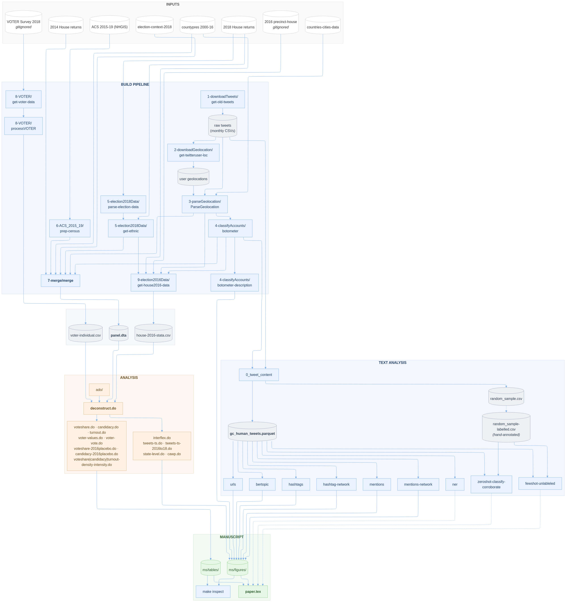

# 📦 Deconstructing the MeToo Movement and the Blue Wave in the 2018 House Elections

[](https://github.com/LSYS/deconstruct/actions/workflows/citations_watch.yml)
[](https://github.com/LSYS/deconstruct/actions/workflows/links.yml)

## 📄 Summary

At the peak of the #MeToo movement in 2018 is the historical performance of women candidates in the 2018 midterm elections.
I examine three ways in which the movement could have an electoral impact using geocoded #MeToo tweets that text analyses show engage core movement discourse and figures, and that geographically predict individual attitudes.
I find no credible evidence that the movement increased Democratic vote shares or turnout.
Instead, I find that in districts with a stronger movement, Democratic women are more likely to challenge their co-partisan male incumbents, a pattern absent in the Republican Party and in 2016.
Hence, the more likely channel is the rise of new Democratic women through a weakening of party norms against same-party challenges.

> Shen, Lucas. Forthcoming. "Deconstructing the MeToo Movement and the Blue Wave in the 2018 House Elections." *Computational Communication Research*.

## 📑 Manuscript

- [`ms/paper.pdf`](ms/paper.pdf)

## 📂 Repo Structure and Scripts

```bash
.
├── build/                      # Python data pipeline
│   ├── 1-downloadTweets/         # raw tweet collection (GetOldTweets-python)
│   ├── 2-downloadGeolocation/    # Twitter user profile locations (Tweepy)
│   ├── 3-parseGeolocation/       # parse user locations to US counties
│   ├── 4-classifyAccounts/       # Botometer bot/human classification
│   ├── 5-election2018Data/       # 2018 House results + candidate ethnicity
│   ├── 6-ACS_2015_19/            # ACS 5-year demographics
│   ├── 7-merge/                  # → panel.dta (master analysis input)
│   ├── 8-VOTER/                  # VOTER survey processing
│   ├── 9-election2016Data/       # 2016 House placebo data
│   └── Makefile                  # `make data`
│
├── text/                       # Python computational text analysis
│   ├── 0_tweet_content.ipynb     # entry point → gc_human_tweets.parquet
│   ├── bertopic.ipynb            # topic modeling
│   ├── hashtags.ipynb            # hashtag tabulation + ECDF
│   ├── hashtag-network.ipynb     # hashtag co-occurrence network
│   ├── mentions.ipynb            # mention tabulation
│   ├── mentions-network.ipynb    # mention network
│   ├── urls.ipynb                # domain tabulation
│   ├── ner.ipynb                 # named-entity counts
│   ├── zeroshot-classify-corroborate.ipynb   # GPT-4o validation vs manual labels
│   ├── fewshot-unlableled.ipynb  # GPT-4o few-shot classification (5000 tweets)
│   └── helpers.py
│
├── analysis/                   # Stata regression analysis
│   ├── ado/                      # custom Stata commands
│   ├── data/                     # static input CSVs (cawp, tweets-ts)
│   ├── set_environment.do        # env + load panel.dta
│   ├── preamble.do               # data prep + variable definitions
│   ├── deconstruct.do            # orchestrator (all tables/figures)
│   └── ...                       # do files
│
├── ms/                         # LaTeX manuscript
│
├── assets/
│
├── Makefile                    # `make setup` creates venv
└── readme.md
```




## Software

- **Python 3.10** with `pandas==2.2.3`, `pyjanitor==0.27.0` — full list in [`assets/requirements.txt`](assets/requirements.txt). Bootstrap with `make setup`.
- **Stata 13+** (15+ for CI-band transparency..)
- Manuscript inspection targets in `ms/Makefile` use [LSYS/texCheckmate](https://github.com/LSYS/texCheckmate), my shell/Make utilities for LaTeX manuscript hygiene (word counts, acronym tally, repeated-word checks, hardcoded-number finder, textidote, etc.).

### 🔄 Stage 1: Data Pipeline (Python)

| Script | Output |
|---|---|
| `build/1-downloadTweets/get-old-tweets.ipynb` | `tweets-data/*.csv` (raw monthly #metoo tweets, one-time scrape) |
| `build/2-downloadGeolocation/get-twitteruser-loc.ipynb` | `out-userGeolocations/twitter-users-*.csv` (Tweepy, one-time) |
| `build/3-parseGeolocation/ParseGeolocation.ipynb` | `parsed-geoloc.csv` (county-level user location) |
| `build/4-classifyAccounts/botometer.ipynb` | `bot-classification.csv` (Botometer scores) |
| `build/4-classifyAccounts/botometer-description.ipynb` | `botometer_score_distribution.pdf` (cited figure) |
| `build/5-election2018Data/parse-election-data.ipynb` | `counties-election-results.csv`, `politicians.csv` |
| `build/5-election2018Data/get-ethnic.ipynb` | `politicians-with-raceindicators.csv` |
| `build/6-ACS_2015_19/prep-census.ipynb` | `acs_2015_2019.csv` |
| `build/7-merge/merge.ipynb` | **`panel.dta`** (master analysis input) |
| `build/8-VOTER/get-voter-data.ipynb` + `processVOTER.ipynb` | `voter-individual.csv` |
| `build/9-election2016Data/get-house2016-data.ipynb` | `house-2016-stata.csv` (2016 placebo) |

#### Running the pipeline
```bash
cd build
make data
```
`make data` runs the 3 terminal notebooks (`7-merge/merge`, `8-VOTER/processVOTER`, `9-election2016Data/get-house2016-data`). Steps 1–6 are one-time fetches whose outputs are committed — Twitter, Botometer, and Census API access are not needed to rebuild `panel.dta`.

### 📝 Stage 2: Computational Text Analysis (Python)

`text/0_tweet_content.ipynb` reads raw tweets from `build/1-downloadTweets/` and bot scores from `build/4-classifyAccounts/`, filters to geocoded human tweets, and writes `text/gc_human_tweets.parquet`. The other 9 notebooks consume that parquet and produce the appendix figures (topic map, hashtag/mention/URL tabulations, networks, NER counts) and the GPT-4o classification artifacts.

Run notebooks individually in Jupyter as needed.

📊 **[Interactive topic map of #MeToo tweets](https://lsys.github.io/deconstruct/topic_2Dmap.html)** — hover for tweet text, zoom into clusters.

### 📊 Stage 3: Statistical Analysis (Stata)

```stata
cd analysis
do deconstruct.do
```

`deconstruct.do` calls each producer script in paper-exhibit order, wrapped in `preserve`/`restore`. Outputs go directly to `ms/tables/` and `ms/figures/`.

## Citations

If this work is useful to you, please consider citing:
> Shen, Lucas. Forthcoming. "Deconstructing the MeToo Movement and the Blue Wave in the 2018 House Elections." *Computational Communication Research*.

**BibTeX:**
```bibtex
@article{deconstruct,
  author  = {Shen, Lucas},
  title   = {Deconstructing the MeToo Movement and the Blue Wave in the 2018 House Elections},
  journal = {Computational Communication Research},
  note    = {forthcoming}
}
```
